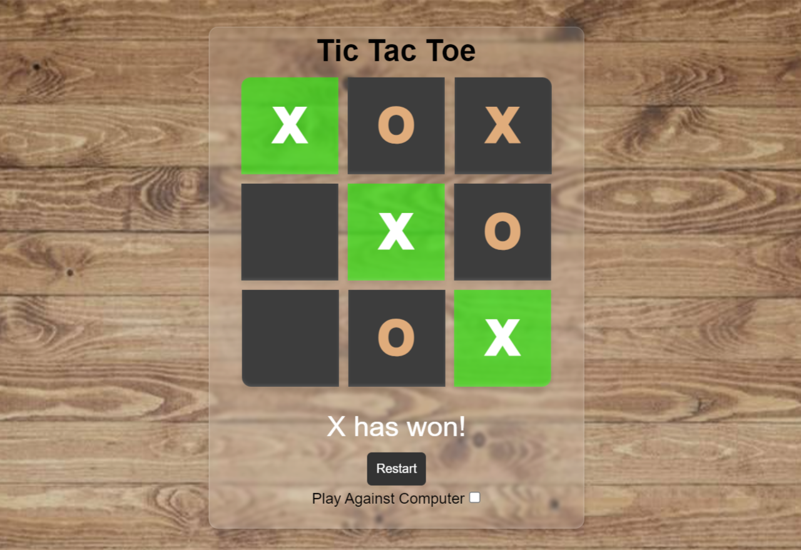

# Tic Tac Toe Game

Welcome to the Tic Tac Toe Game! This interactive web-based Tic Tac Toe project showcases a classic game with a modern twist, featuring advanced CSS styling for a visually appealing experience.

## Features

- Play the timeless game of Tic Tac Toe right in your browser.
- Enjoy sleek and stylish visual design through advanced CSS techniques.
- Responsive layout ensures optimal gameplay on various devices and screen sizes.
- Choose between playing against a friend or challenging the computer.
- Interactive controls make it easy to restart the game whenever you want.

## How to Play

1. Open the game in a modern web browser.
2. Choose to play against a friend or enable the computer opponent.
3. Click on the empty cells to place your X or O, taking turns with your opponent.
4. The first player to get three of their marks in a row, column, or diagonal wins.
5. If all cells are filled without a winner, the game ends in a draw.

## Technologies Used

- HTML: Structured the game layout and components.
- CSS: Applied advanced styling techniques for an enhanced visual experience.
- JavaScript: Handled the game's logic and interactions.
- Responsive Design: Ensured the game adapts to different screen sizes.
  
## Getting Started

To play the game locally or explore the codebase, follow these steps:

1. Clone this repository to your local machine.
2. Open the `index.html` file in a web browser.
3. Start playing Tic Tac Toe with the advanced CSS styling.

Feel free to customize, modify, and learn from the code to enhance your own web development skills.

## Credits

This project was inspired by the classic game of Tic Tac Toe and was created by Bijay Pandey. If you find this project useful or have suggestions for improvements, feel free to contribute by submitting issues or pull requests.

Enjoy the game and have fun challenging your friends or testing your skills against the computer!
🚀[Live Demo](https://cognisolver.github.io/tic-tac-toe/)

---

*Disclaimer: This project is for educational purposes and entertainment. It is not affiliated with or endorsed by the official Tic Tac Toe game.*
